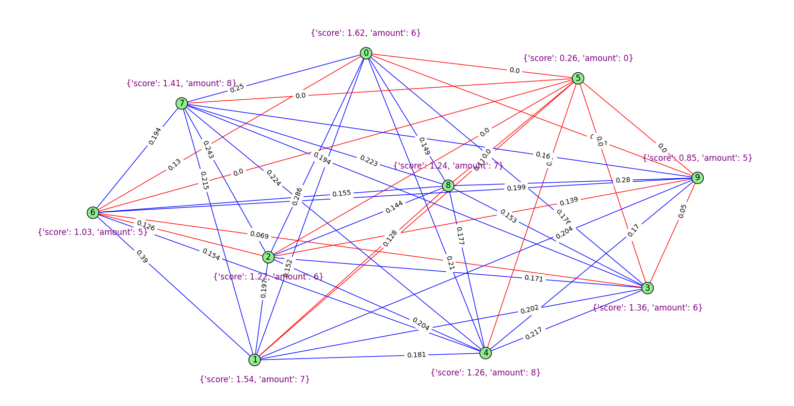

## GRAPH-BASED TEXT SUMMARY PROJECT

Purpose: reinforcing knowledge of data structures and problems. It aims to develop problem-solving skills.

- The project aims to process a text then turn it into a graph model and visualize the model.

- First steps are about natural language processing. After the natural language processing steps
  many similarity algorithms and sentence score calculation
  algorithms are available, then these scores and similarities.
  After calculating the ratios, the work is converted into a visual graph structure.

  

 - The technologies being used are PyQT5, networkX, matplotlib, NLTK.  
